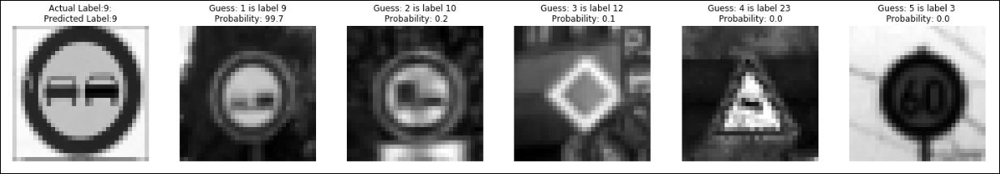

# **Traffic Sign Recognition** 

## Writeup - Gaurav Pokharkar

---

**Build a Traffic Sign Recognition Project**

The goals / steps of this project are the following:
* Load the data set (see below for links to the project data set)
* Explore, summarize and visualize the data set
* Design, train and test a model architecture
* Use the model to make predictions on new images
* Analyze the softmax probabilities of the new images
* Summarize the results with a written report

---
### Writeup / README

#### 1. Provide a Writeup / README that includes all the rubric points and how you addressed each one. You can submit your writeup as markdown or pdf. You can use this template as a guide for writing the report. The submission includes the project code.

##### My project submission includes all required files.

* Ipython notebook with code [Gaurav Notebook](https://view5f1639b6.udacity-student-workspaces.com/notebooks/CarND-Traffic-Sign-Classifier-Project/Traffic_Sign_Classifier.ipynb)
* HTML output of the code [Gaurav Notebook HTML](https://classroom.udacity.com/nanodegrees/nd013/parts/edf28735-efc1-4b99-8fbb-ba9c432239c8/modules/6b6c37bc-13a5-47c7-88ed-eb1fce9789a0/lessons/7ee8d0d4-561e-4101-8615-66e0ab8ea8c8/concepts/a96fb396-2997-46e5-bed8-543a16e4f72e)
* This is the writeup report in markdown format

##### Dataset Exploration
###### Dataset Summary - Plotted histogram plots for the training, validation and test datasets

###### Exploratory Visualization - Plotted random 10 images from training dataset

##### Design and Test a Model Architecture
###### Preprocessing 
I created a `normalize_image` function to return and RGB image, Grayscale image and Normalized image. Normalized the image data by applying approximate formula `(pixel - 128)/ 128` as per taught in the class.
###### Model Architecture
Implemented the [LeNet Lab Solution](https://classroom.udacity.com/nanodegrees/nd013/parts/edf28735-efc1-4b99-8fbb-ba9c432239c8/modules/6b6c37bc-13a5-47c7-88ed-eb1fce9789a0/lessons/0fb1d383-484e-4c49-a0e4-03922c1416d6/concepts/8a6df4e1-252b-4cf5-b7b4-aac383e563c5#) neural network architecture.

* Input
The LeNet architecture accepts a 32x32xC image as input, where C is the number of color channels. Since these images are color in RGB format, C is 3 in this case.

* Architecture
    * _Layer 1 Convolutional_: The output shape should be 28x28x6.

    * _Activation_: To make the entire model non-linear but to keep the parameters inside big linear functions we use ReLU as the activation fucntion. Used `tf.nn.relu()` as the activation function.

    * _Pooling_: Striding is an aggressive way to down sample and image lot of important information can be lost in this process. Hence using pooling to reduce the spatial extent of the future maps in the convulutional pyramid. Pooling is the process in which we take small strides and then look at the convolutions in a neighborhood and combine them somehow. I have used `tf.nn.max_pool()`. The output shape should be 14x14x6.

    * _Layer 2 Convolutional_: The output shape should be 10x10x16.

    * _Activation_: To make the entire model non-linear I used `tf.nn.relu()` as the activation function.

    * _Pooling_: The output shape should be 5x5x16.

    * _Flatten_: Flatten the output shape of the final pooling layer such that it's 1D instead of 3D. The easiest way to do is by using `tf.contrib.layers.flatten`.

    * _Layer 3 Fully Connected_: This should have 120 outputs.

    * _Activation_: Used `tf.nn.relu()` as the activation function.

    * _Dropout_: Used `tf.nn.dropout()` to force the network learn using redundant representation for everything by appplying a drop probility of 50%. This helps make the network robust and prevents overfitting.
    
    * _Layer 4 Fully Connected_: This should have 84 outputs.

    * _Activation_: Your choice of activation function.
    
    * _Dropout_: Used `tf.nn.dropout()`.

    * _Layer 5 Fully Connected (Logits)_: This should have 43 outputs.

    * _Output_: Return the result of the 2nd fully connected layer.

* Model Training - Trained the model using `tf.train.AdamOptimizer()` to minimize the `cross_entropy`. Used the training dataset (`X_train, y_train`) to train the model.
* Solution Approach - Used the validation dataset (`X_valid, y_valid`) to validate the model and then later used the test dataset (`X_test, y_test`) to calculate the accuracy of the model.

##### Test a Model on New Images
* Acquiring New Images - Acquired new images using Google images. Resized the images to 32x32 and then tested them using the model.
* Performance on New Images - I had to modify the images a little bit and also had to use a bit easy case scenarios. I observed that resizing, scaling of the images obtained from the internet had issues with the model being able to correctly predict them. The model should be made more robust to the input images size and sccaling factor.
* Model Certainty - Softmax Probabilities - Used `tf.nn.top_k()` to study the top probabilities of the classified images and to compare the predicted labels to their corresponding true labels. 

### Data Set Summary & Exploration

#### 1. Provide a basic summary of the data set. In the code, the analysis should be done using python, numpy and/or pandas methods rather than hardcoding results manually.

Summary statistics of the traffic signs data set:

* The size of training set is 34799
* The size of the validation set is 4410
* The size of test set is 12630
* The shape of a traffic sign image is (32, 32, 3)
* The number of unique classes/labels in the data set is 43

#### 2. Include an exploratory visualization of the dataset.

### Design and Test a Model Architecture

#### 1. Describe how you preprocessed the image data. What techniques were chosen and why did you choose these techniques? Consider including images showing the output of each preprocessing technique. Pre-processing refers to techniques such as converting to grayscale, normalization, etc. (OPTIONAL: As described in the "Stand Out Suggestions" part of the rubric, if you generated additional data for training, describe why you decided to generate additional data, how you generated the data, and provide example images of the additional data. Then describe the characteristics of the augmented training set like number of images in the set, number of images for each class, etc.)

I created a `normalize_image` function to return and RGB image, Grayscale image and Normalized image. Normalized the image data by applying approximate formula `(pixel - 128)/ 128` as per taught in the class.

**RGB Image**

**Grayscale Image**

**Normalized Image**

* Grayscale - It helps to reduce the training time. Also this helps to make the model independent of the lighting condition.
* Normalized Data - Too large or too small values causes issues during the calculation. Hence it is a good guiding principle to have zero mean and equal variance hence we normalize the data. It does not change the image content but makes it easier for optimizagtion to proceed.
* Shuffle - Later using `from sklearn.utils import shuffle` I shuffled the training, validation and testing dataset to avoid any biases. 

#### 2. Describe what your final model architecture looks like including model type, layers, layer sizes, connectivity, etc.) Consider including a diagram and/or table describing the final model.

My final model consisted of the following layers:

| Layer         		|     Description	        					| 
|:---------------------:|:---------------------------------------------:| 
| Input         		| 32x32x1 Normalized image   					| 
| L1 Convolution 3x3    | 1x1 stride, valid padding, outputs 28x28x6 	|
| RELU					|												|
| Max pooling	      	| 2x2 stride,  outputs 14x14x6 				    |
| L2 Convolution 3x3	| 1x1 stride, valid padding, outputs 10x10x16   |
| RELU		            |        									    |
|Pooling				|2x2 stride,  outputs 5x5x16         			|
|Flatten				| output 400									|
|Fully Connected		|	output 120									|
|RELU                   |                                               | 
|Dropout                |                                               |
|Fully Connected        | output 84                                     |
|RELU                   |                                               |
|Dropout                |                                               |
|Fully Connected        | output 43                                     |

                          
#### 3. Describe how you trained your model. The discussion can include the type of optimizer, the batch size, number of epochs and any hyperparameters such as learning rate.

Model Training - Trained the model using `tf.train.AdamOptimizer()` to minimize the `cross_entropy`. Used the training dataset (`X_train, y_train`) to train the model.
EPOCH = 60
Rate = 0.00097
Batch = 128
Dropout = 0.5

#### 4. Describe the approach taken for finding a solution and getting the validation set accuracy to be at least 0.93. Include in the discussion the results on the training, validation and test sets and where in the code these were calculated. Your approach may have been an iterative process, in which case, outline the steps you took to get to the final solution and why you chose those steps. Perhaps your solution involved an already well known implementation or architecture. In this case, discuss why you think the architecture is suitable for the current problem.

My final model results were:
* Validation set accuracy of 97% 

* Test set accuracy of 95%

If an iterative approach was chosen:
* What was the first architecture that was tried and why was it chosen?
  * First I had selected the [LeNet Lab Solution](https://classroom.udacity.com/nanodegrees/nd013/parts/edf28735-efc1-4b99-8fbb-ba9c432239c8/modules/6b6c37bc-13a5-47c7-88ed-eb1fce9789a0/lessons/0fb1d383-484e-4c49-a0e4-03922c1416d6/concepts/8a6df4e1-252b-4cf5-b7b4-aac383e563c5#) neural network architecture as it is.
  
* What were some problems with the initial architecture?
  * Validation set accuracy of 93%
  * Test set accuracy of 91% 
  * This indicated under fitting of the model
  * Initial Architecture

| Layer         		|     Description	        					| 
|:---------------------:|:---------------------------------------------:| 
| Input         		| 32x32x1 Normalized image   					| 
| L1 Convolution 3x3    | 1x1 stride, valid padding, outputs 28x28x6 	|
| RELU					|												|
| Max pooling	      	| 2x2 stride,  outputs 14x14x6 				    |
| L2 Convolution 3x3	| 1x1 stride, valid padding, outputs 10x10x16   |
| RELU		            |        									    |
|Pooling				|2x2 stride,  outputs 5x5x16         			|
|Flatten				| output 400									|
|Fully Connected		|	output 120									|
|RELU                   |                                               | 
|Fully Connected        | output 84                                     |
|RELU                   |                                               |
|Fully Connected        | output 43                                     |
  
* How was the architecture adjusted and why was it adjusted? Typical adjustments could include choosing a different model architecture, adding or taking away layers (pooling, dropout, convolution, etc), using an activation function or changing the activation function. One common justification for adjusting an architecture would be due to overfitting or underfitting. A high accuracy on the training set but low accuracy on the validation set indicates over fitting; a low accuracy on both sets indicates under fitting.
  * I modified the architecture by adding `tf.nn.dropout()` to force the network learn using redundant representation for everything by appplying a drop probility of 50%. This helps make the network robust and prevents overfitting. 

* Which parameters were tuned? How were they adjusted and why?
  * I played around with the EPOCH and learning rate.
  * First started with a high learning rate (0.001) and later kept reducing it till I observed almost no change in the the accuracy for the test dataset and then I stopped at around 0.00097 value.
  * Modified the EPOCH value and observed that as I increased the value of EPOCH beyond I didnt obaserve any significant change in the accuracy for the test data set.

* What are some of the important design choices and why were they chosen? For example, why might a convolution layer work well with this problem? How might a dropout layer help with creating a successful model?

If a well known architecture was chosen:
* What architecture was chosen?
* Why did you believe it would be relevant to the traffic sign application?
* How does the final model's accuracy on the training, validation and test set provide evidence that the model is working well?
 

### Test a Model on New Images

#### 1. Choose five German traffic signs found on the web and provide them in the report. For each image, discuss what quality or qualities might be difficult to classify.

Here are German traffic signs that I found on the web:

All these images are a bit difficult to identify beacuse when I resize them to 32x32 they become blurry and this cause a bit issue with the classifier.

#### 2. Discuss the model's predictions on these new traffic signs and compare the results to predicting on the test set. At a minimum, discuss what the predictions were, the accuracy on these new predictions, and compare the accuracy to the accuracy on the test set (OPTIONAL: Discuss the results in more detail as described in the "Stand Out Suggestions" part of the rubric).

Here are the results of the prediction:

The model was able to correctly guess 6 of the 6 traffic signs, which gives an accuracy of 100% which is better than the 97% validation accuracy and the 95% test accuracy. This shows that the model performs well on real-world data. We resonalbly assume that  accuracy would decrease if more data points are given. The model can be made more robust by augmenting the training and validation dataset. We can safely assume that if the real world data chosen is easily distinguishable like that of those sample images we can reasonably classify them.

#### 3. Describe how certain the model is when predicting on each of the five new images by looking at the softmax probabilities for each prediction. Provide the top 5 softmax probabilities for each image along with the sign type of each probability. (OPTIONAL: as described in the "Stand Out Suggestions" part of the rubric, visualizations can also be provided such as bar charts)

Top 5 guess using the top 5 softmax values for the new images

### (Optional) Visualizing the Neural Network (See Step 4 of the Ipython notebook for more details)
#### 1. Discuss the visual output of your trained network's feature maps. What characteristics did the neural network use to make classifications?

